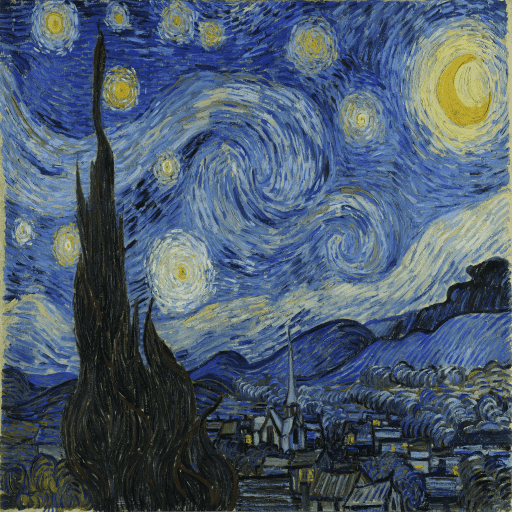
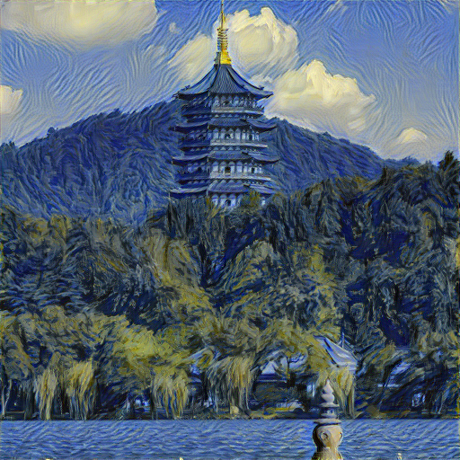
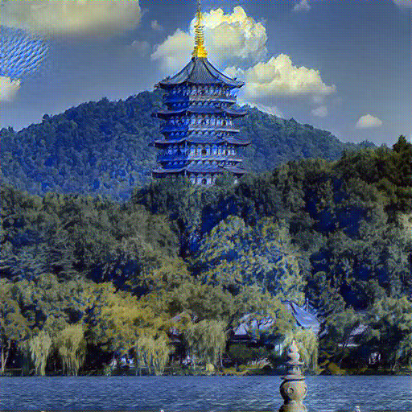

# Optimization of Neural Style Transfer

This project optimizes the original **Neural Style Transfer (NST)** method proposed by [Gatys et al., 2015](https://www.cv-foundation.org/openaccess/content_cvpr_2016/papers/Gatys_Image_Style_Transfer_CVPR_2016_paper.pdf), implemented in PyTorch from scratch. It synthesizes new images by combining the content of one image and the style of another, using the feature space of a pre-trained VGG-19 network.

## Project Highlights

- No use of existing code from Gatys et al.—our pipeline is written independently for clarity and modularity.
- Uses VGG-19 as a fixed feature extractor to calculate:
  - Content Loss (via MSE between feature maps)
  - Style Loss (via MSE between Gram matrices)
- Optimization with L-BFGS over 300 - 500 iterations
- Compatible with both CPU and GPU
- Output: stylized images balancing structure and texture

## 🚀 Getting Started

### 1. Clone and Install Dependencies

```bash
git clone https://github.com/yourusername/neural-style-transfer-pytorch.git
cd neural-style-transfer-pytorch
pip install -r requirements.txt
```

> Required packages: `torch`, `torchvision`, `PIL`, `matplotlib`

### 2. Run Style Transfer

```bash
python main.py --content path/to/content.jpeg --style path/to/style.jpg --output output.png
```

Optional arguments:
- `--image_size`: image resolution (default: 512)
- `--content_weight`: default 1
- `--style_weight`: default 1e6
- `--iterations`: default 300

## 📊 Results

With the recommended weights `α=1` and `β=1e6`, the system generates outputs that preserve the spatial structure of the content image and reflect the color, texture, and brushstroke patterns of the style image.

<p>
  In our implementation, we applied NST to a natural landscape photo using <i>The Starry Night</i> by Van Gogh as the style image. 
  The result successfully preserves the structure of the content while capturing the textures and color palette of the painting.
</p>

<div align="center">
  <table>
    <tr>
      <td align="center"></td>
      <td align="center" style="font-size: 36px; vertical-align: middle;">+</td>
      <td align="center"></td>
      <td align="center" style="font-size: 36px; vertical-align: middle;">=</td>
      <td align="center"></td>
    </tr>
    <tr>
      <td align="center"><b>Content</b></td>
      <td></td>
      <td align="center"><b>Style</b></td>
      <td></td>
      <td align="center"><b>Stylized Output</b></td>
    </tr>
  </table>
</div>

## 📄 Report Summary

Our project confirms the following:

- CNN feature layers successfully separate content (deep layers) and style (shallow layers)
- The L-BFGS optimization converges stably in about 300 iterations
- Adjusting the content/style weight ratio gives intuitive control over the result

We also compared VGG-19 and ResNet18 backbones and found that **VGG-19 consistently produced more coherent and visually pleasing stylized results**, confirming its effectiveness for perceptual tasks in style transfer.
<center>

<div align="center">
  <table>
    <tr>
      <td align="center">
        <br/>
        <b>ResNet18 Output</b>
      </td>
      <td align="center" style="vertical-align:middle; width:80px;">
        <b style="font-size: 24px;">V.S.</b>
      </td>
      <td align="center">
        <br/>
        <b>VGG19 Output</b>
      </td>
    </tr>
  </table>
</div>


</center>

## ⚙️ Running on CPU vs GPU
- This project supports both CPU and GPU execution. By default, it automatically detects whether a CUDA-enabled GPU is available and uses it to accelerate computation. If no GPU is detected, the program will fall back to CPU execution.

## 🔧 Future Improvements

- Replace VGG19 with lightweight models (e.g., MobileNet, EfficientNet) for mobile deployment
- Add support for multi-style fusion and video stylization
- Deploy as a REST API or interactive web application

## 📜 References

- Gatys, Leon A., et al. *Image Style Transfer Using Convolutional Neural Networks*. CVPR, 2016.
- Johnson et al., *Perceptual Losses for Real-Time Style Transfer and Super-Resolution*, ECCV 2016.
- PyTorch Tutorials: https://pytorch.org/tutorials/
---